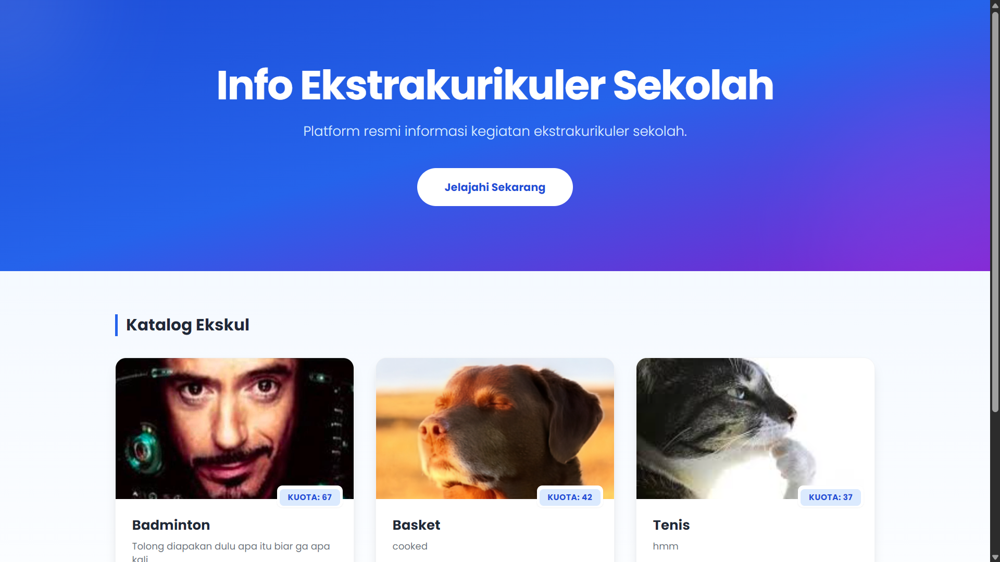
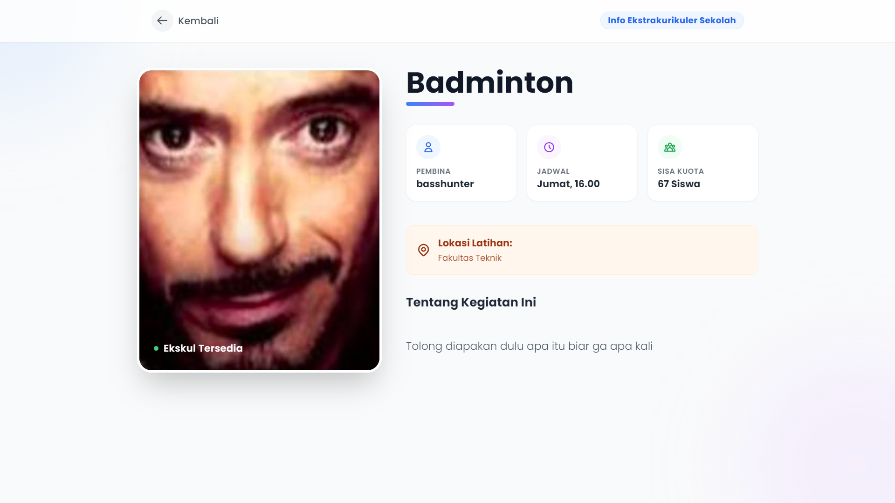
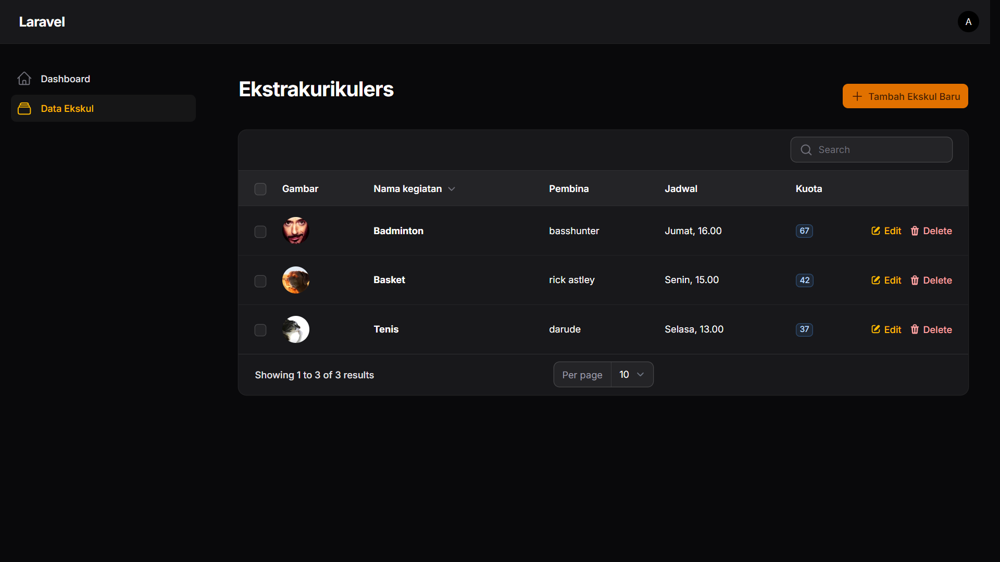

## Tentang Projek Ini

Sistem Informasi Ekstrakurikuler Simpel yang dibuat untuk memenuhi mini project dari Workshop 2025 HMIF, dibuat menggunakan Laravel 12 dan Filament.

Pada sistem ini user dapat mengakses halaman untuk melihat informasi dari ekstrakurikuler serta melihat detail dari ekstrakurikuler tersebut, admin dapat melakukan CRUD pada data dari ekstrakurikuler yang di tampilkan di halaman user dari halaman admin filament.

